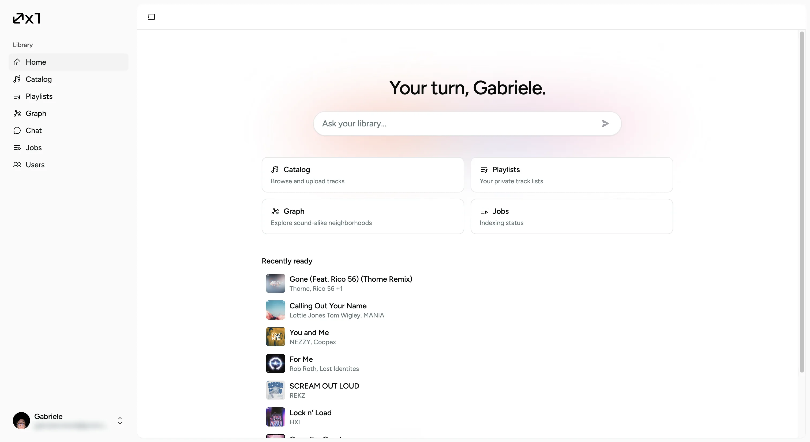
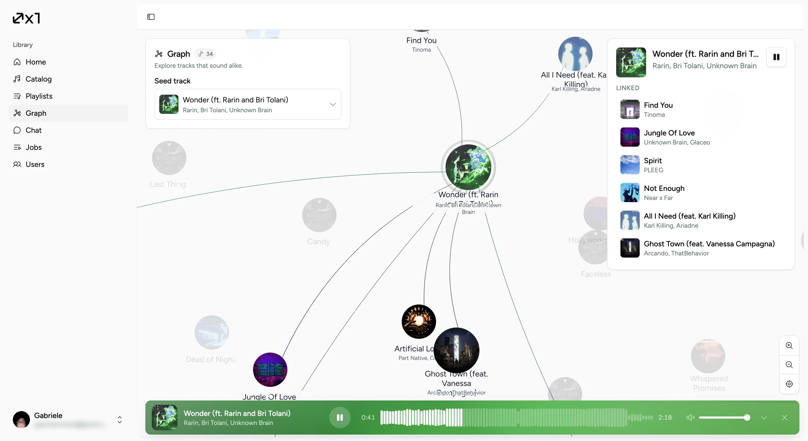
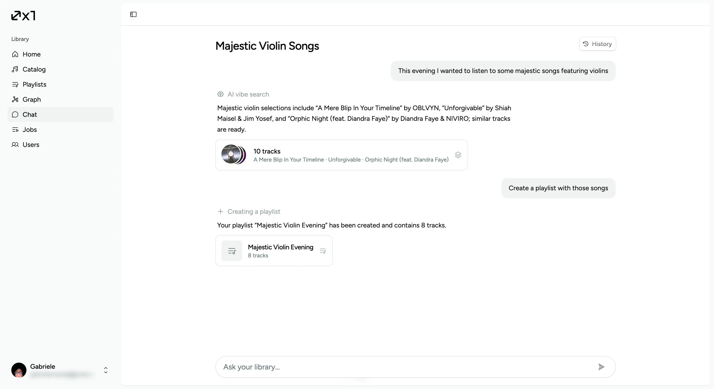

<p align="center">
  
</p>

**0x1audio** is a personal music catalog with ML indexing. Import your tracks, search by natural language or sound, and explore a similarity graph.

```text
apps/frontend     React UI
apps/backend      API + ingest worker
apps/ml-worker    gRPC embeddings → Qdrant
proto/            shared protobuf
```

```bash
cp .env.example .env
docker compose -f compose.yaml -f compose.dev.yaml up --build
```

Requires NVIDIA Container Toolkit for the ML worker. Architecture: [apps/ml-worker/README.md](apps/ml-worker/README.md).

## Use cases

### Home

Ask your library, jump into catalog / playlists / graph / jobs, and see what just finished indexing.

<p align="center">
  
</p>

### Graph

Pick a seed track and walk the sound-alike neighborhood — linked tracks, playback, and the similarity map.

<p align="center">
  
</p>

### Chat

Describe a vibe in natural language, get matching tracks, then create a playlist from the same conversation.

<p align="center">
  
</p>
