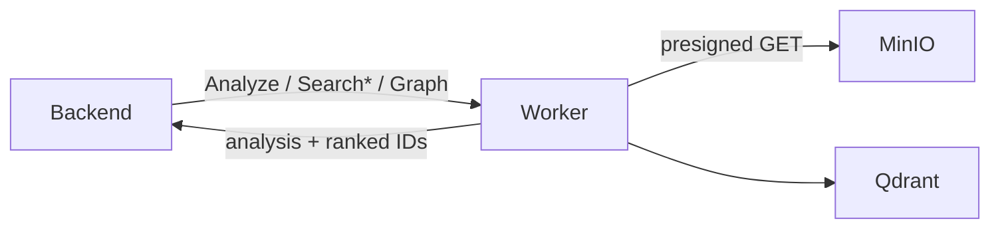
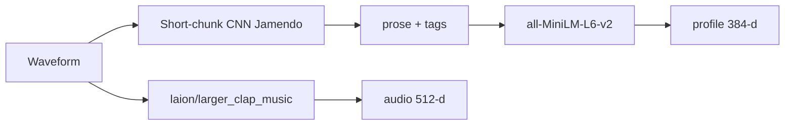
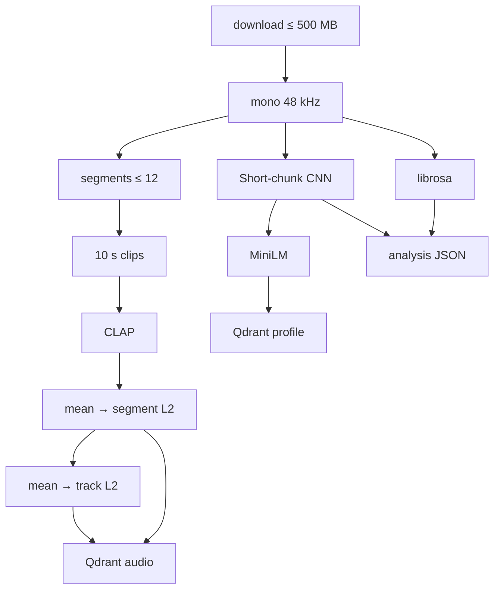
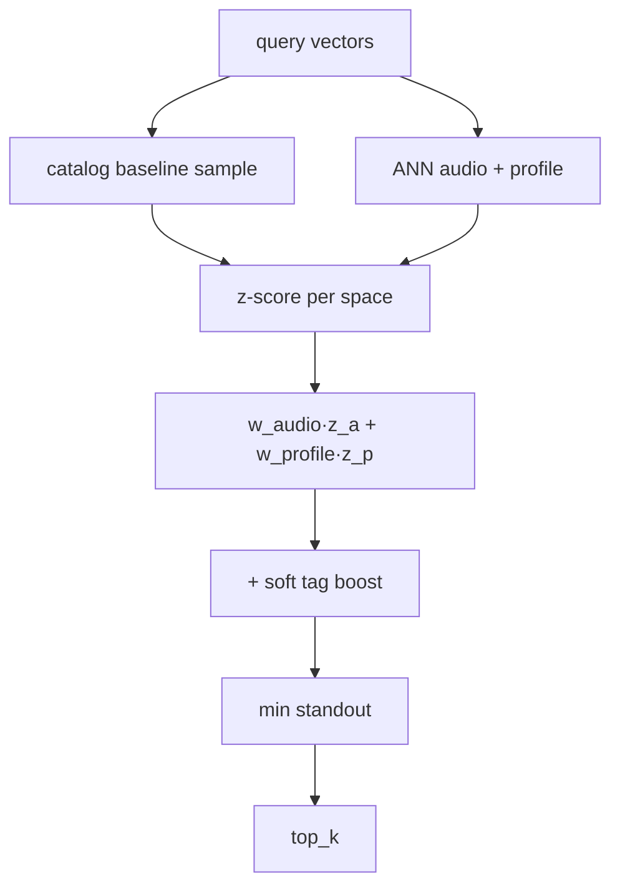
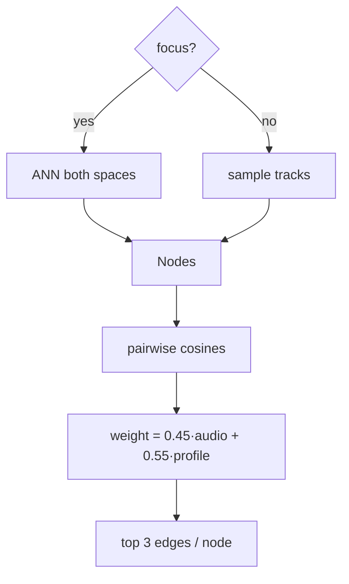

# ML worker

Stateless gRPC compute plane. Downloads audio via short-lived MinIO URLs, writes dual vectors to Qdrant. No Postgres, no auth.

## Context



| RPC | Role |
|-----|------|
| `AnalyzeTrack` | Download → analyze → embed → upsert |
| `SearchText` | NL query in audio + profile spaces |
| `SearchAudio` | Query from reference audio |
| `SimilarTracks` | Neighbors of an indexed track |
| `Graph` | Bounded similarity neighborhood |

## Models



| Model | License | Dim | Job |
|-------|---------|-----|-----|
| `laion/larger_clap_music` | Apache 2.0 (weights) | 512 | joint audio ↔ text |
| `all-MiniLM-L6-v2` | Apache 2.0 | 384 | language profile |
| Short-chunk CNN + Res (Jamendo top-50) | MIT | — | genre / instrument / mood tags |
| librosa | ISC | — | BPM, energy, waveform |

CLAP at 48 kHz mono (10 s clips). Short-chunk CNN at 16 kHz with 3.69 s chunks. Collection names include model + tagger version — recipe changes need a reindex (old collections stay for rollback).

## Analyze



Aggregation: `clip → mean → segment → mean → track` (all L2). Profile is a blend of sentence + tag embeddings (`config.yaml`). Soft `search_tags` on the profile payload for ranking boost — never a hard lexical gate.

## Ranking

Raw cosine is not comparable across spaces. Calibrate, then blend.



Defaults live in [`config.yaml`](./config.yaml) (`audio_search_weight` 0.45 / `profile_search_weight` 0.55). Tune via `evals/golden_queries.json` + reindex — not a pile of env flags.

## Graph

Similarity neighborhood only: nearby in CLAP and/or MiniLM, then pairwise edges.



UI draws on blended `weight`. `audio_weight` / `profile_weight` stay on the payload for debug.

## Run

CUDA required (`torch.cuda.is_available()`). NVIDIA Container Toolkit on the host.

```bash
uv run python scripts/download_short_chunk_model.py
# Ensure laion/larger_clap_music is in HF_HOME (Compose volume ml_worker_hf)
docker compose -f compose.yaml -f compose.dev.yaml up -d --build ml-worker backend-worker
```

Config: [`config.yaml`](./config.yaml). Personal overrides: `cp config.local.example.yaml config.local.yaml`.

Priority: **env → `config.local.yaml` → `config.yaml` → defaults**.

| Env | Role |
|-----|------|
| `QDRANT_URL` | vector DB |
| `QDRANT_API_KEY` | optional |
| `HOST` / `PORT` | gRPC bind |
| `HF_HOME` | model cache (Compose: `/models/huggingface`) |

Proto: `proto/ox1audio/v1/ml_worker.proto`.
