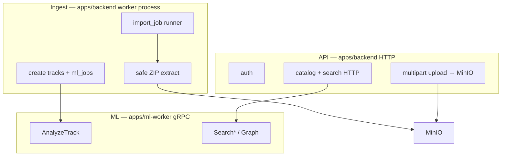

# Data ingestion

How audio enters Tunelink and becomes catalog rows ready for ML. Keep this
path **simple and isolated** from auth and from ML math.

See also [SPEC.md](SPEC.md) (ownership) and [ML.md](ML.md) (index/search).

---

## Three planes (do not mix)



| Plane | Process | Owns | Must not own |
|-------|---------|------|----------------|
| **API** | `uvicorn` | Auth, OpenAPI, file upload proxy to MinIO, job status, search/graph HTTP that *calls* ML | ZIP unpack, long loops, model inference |
| **Ingest** | `python -m tunelink_backend.worker` (same package, second container) | `import_job` lifecycle, safe archive extract, fan-out to tracks + `ml_job`, enqueue AnalyzeTrack | Auth, Qdrant math, embedding models |
| **ML** | `apps/ml-worker` | Analyze / search / graph, Qdrant writes | Postgres auth, ZIP handling, permanent S3 keys |

Same git package for API + ingest (`apps/backend`) so shared models/DB stay one place; **separate OS process** so a bad ZIP cannot stall login/search.

---

## Upload modes

### 1. Single track

1. Browser POSTs the file to the API (`multipart/form-data`).
2. API streams the object to MinIO, creates `track` (`queued`) + `ml_job`.
3. Ingest worker claims the `ml_job` and submits `AnalyzeTrack` (API stays thin).
4. ML worker analyzes → ingest stores analysis, `track` → `ready` \| `failed`.

Uploads go through the API (not browser→MinIO presign) so CORS stays simple.

### 2. ZIP batch

1. Browser POSTs the ZIP to the API (`multipart/form-data`).
2. API stores the archive in MinIO and creates `import_job` (`queued`) — no unpack on the request.
3. **Ingest worker** claims the job → safe extract → one object + `track` + `ml_job` per audio file.
4. Existing `ml_job` loop indexes each track; `import_job` counts progress until complete/failed.

No Spotify/YouTube rippers. Only user-supplied files (see SPEC non-goals).

---

## ZIP safety (ingest worker only)

Hard limits (tune in config, fail the job if exceeded):

| Limit | Default |
|-------|---------|
| Archive size | 12 GB |
| Uncompressed total | 12 GB |
| File count | 2000 |
| Per-file size | 100 MB |
| Allowed extensions | `.mp3 .wav .flac .m4a .ogg .aac` |

Rules:

- Never `extractall` blindly.
- Reject `..`, absolute paths, symlinks (Zip Slip).
- Rewrite object keys to `tracks/{track_id}/{safe_filename}` — never trust archive paths.
- API spools the ZIP to disk then `fput`s to MinIO (no multi‑GB RAM buffer).
- Ingest streams entry-by-entry (one audio file in memory); abort on first limit breach.
- Delete the import object from MinIO after a successful fan-out.
- Run only inside the ingest worker process.

---

## Code layout (backend package)

Keep modules boring and named for their plane:

```text
apps/backend/src/tunelink_backend/
  main.py                 # FastAPI app wiring only
  config.py
  db.py
  models.py               # shared tables
  auth/                   # session helpers — deps, passwords, tokens (no HTTP)
  api/                    # HTTP routers only
    router.py             # aggregates under /api/v1
    auth.py
    catalog.py
    health.py
  ingest/                 # Ingest plane — zip safety, import_job runner
    zip_safe.py
    runner.py
  ml_client/              # thin gRPC client (generated stubs under generated/)
    client.py
    generated/
  worker.py               # entrypoint: loop claiming import/ml orchestration jobs
```

Rules of thumb:

- `auth/` never imports `ingest/`.
- `ingest/` never imports FastAPI routers.
- `ml-worker` never imports backend models or auth.
- Prefer small functions with obvious names over clever pipelines.

---

## Job tables

| Table | Owner plane | Purpose |
|-------|-------------|---------|
| `import_job` | Ingest | Batch ZIP (or multi-file) progress |
| `ml_job` | Ingest creates; ML executes | Per-track analyze |
| `track` | API creates (single); ingest creates (batch) | Catalog row + status |

Status flow for a track: `uploading` → `queued` → `indexing` → `ready` \| `failed`.
