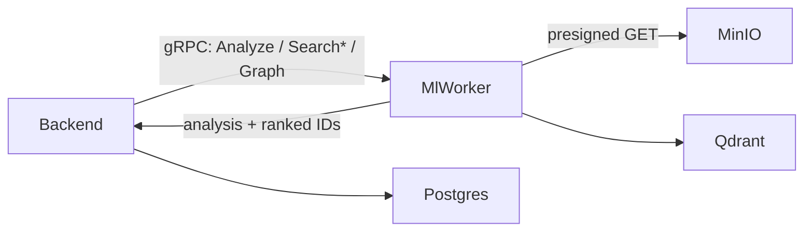
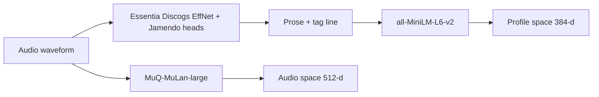
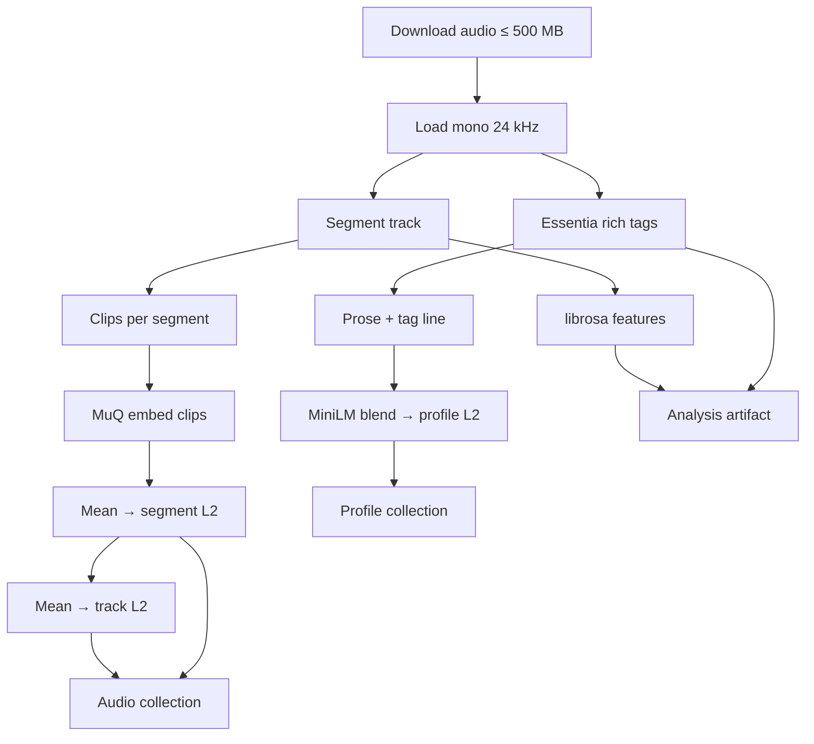
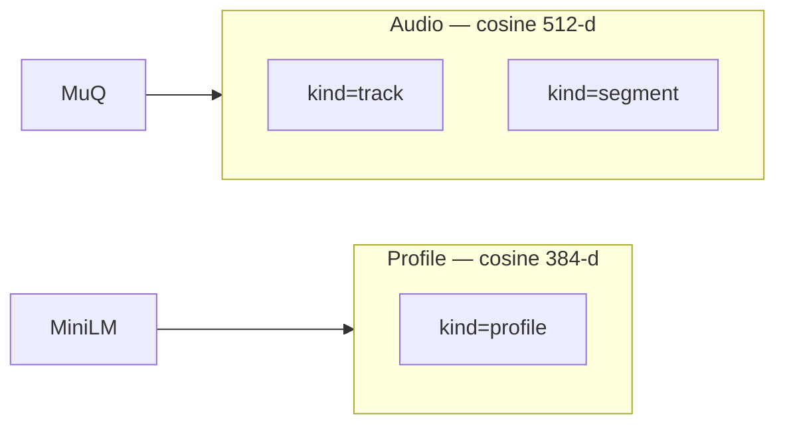
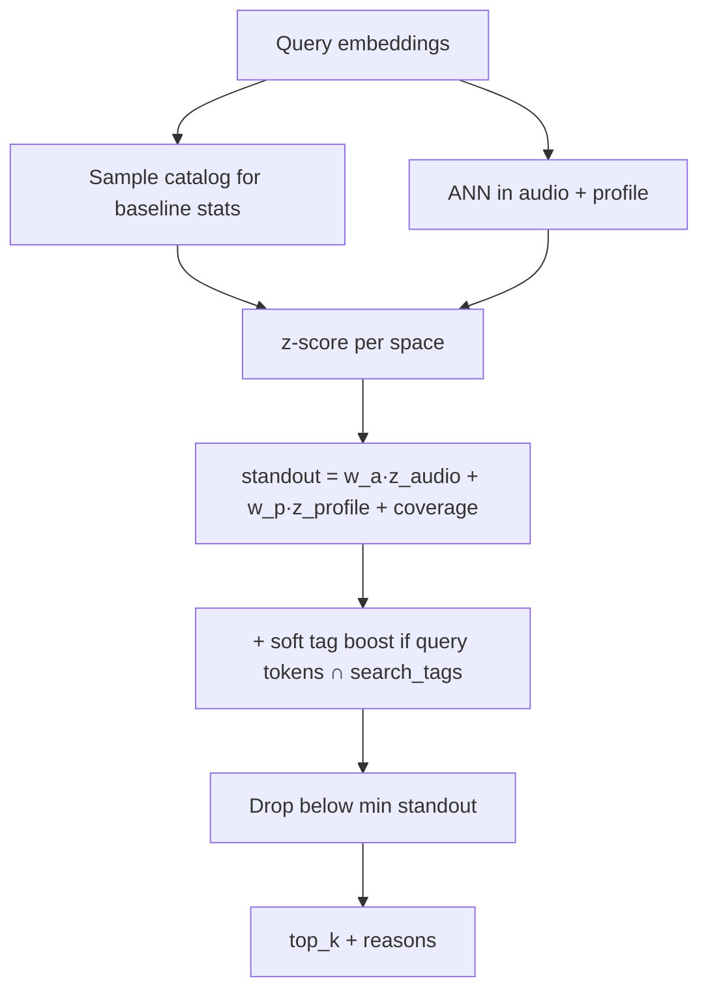
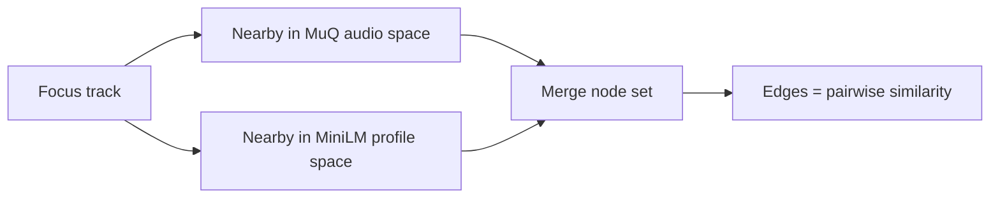
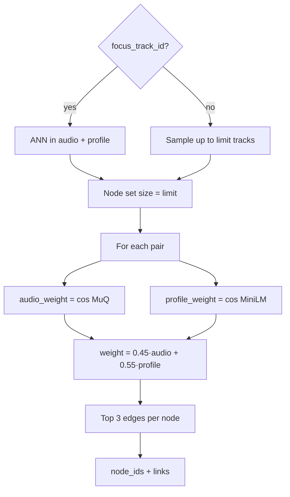
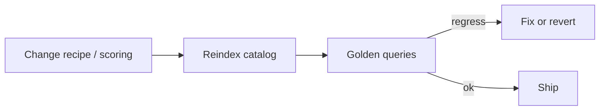

# Tunelink ML architecture

Target design for `apps/ml-worker`. Evolved from the goodtaste MVP
([`__OLD__/apps/ml-pipeline`](file:///Users/gabrielemidulla/Documents/GitHub/goodtaste/__OLD__/apps/ml-pipeline))
with deliberate changes called out below.

MVP reference (ideas / numbers, not copy-paste):

| Topic | Path |
|-------|------|
| Ops / scoring notes | `goodtaste/__OLD__/apps/ml-pipeline/README.md` |
| Contracts | `…/runpod_worker/contracts.py` |
| Analyze / search / graph | `…/runpod_worker/operations.py` |
| Segments / clips | `…/runpod_worker/audio_analysis.py` |
| Essentia | `…/runpod_worker/rich_audio_analysis.py` |
| Embedders | `…/runpod_worker/model_provider.py` |
| Qdrant + scoring | `…/runpod_worker/vector_store.py` |

---

## What we keep vs change

| Keep from MVP | Change for Tunelink |
|---------------|---------------------|
| Dual spaces: MuQ audio + MiniLM profile | Drop org filters (single catalog) |
| Clip → segment → track aggregation | **No hard lexical veto** that scrolls the whole catalog |
| Z-score calibration vs catalog baseline | Soft tag **boost**, not a gate |
| Essentia → readable profile text | Clear graph field names (`audio_weight` / `profile_weight`) |
| Golden-query evals + reindex discipline | Fewer live thresholds; bake defaults, tune via evals |
| Stateless worker + presigned audio | gRPC + protobuf (`proto/`), not RunPod HTTP |

---

## Goals

- Index audio into a **dual embedding space** (sonic + language profile).
- Support NL search, audio search, similar tracks, and a similarity **neighborhood graph**.
- Keep the worker **stateless**: short-lived audio URLs in; vectors + analysis out.
- Prefer **recall of good semantic matches** over brittle keyword vetoes.

---

## System context



Backend owns catalog rows, jobs, and hydration. Worker owns models, Qdrant, ranking.

---

## Operations (gRPC)

```mermaid
flowchart TB
  subgraph ops [MlWorker RPCs]
    analyze[AnalyzeTrack]
    searchText[SearchText]
    searchAudio[SearchAudio]
    similar[SimilarTracks]
    graph[Graph]
  end

  analyze --> Upsert[Upsert dual Qdrant collections]
  searchText --> Dual[Retrieve audio + profile]
  searchAudio --> AudioOnly[Retrieve audio]
  similar --> Dual
  graph --> Neighborhood[ANN neighborhood + pairwise edges]
  Dual --> Rank[Calibrated blend + soft tag boost]
  AudioOnly --> Rank
```

| RPC | Default | Notes |
|-----|---------|-------|
| `AnalyzeTrack` | async job | Download → analyze → embed → upsert → analysis JSON |
| `SearchText` | `top_k=6` (max 20) | MuQ text + MiniLM profile; soft tag boost |
| `SearchAudio` | `top_k=6` | Mean of clip MuQ vectors as query |
| `SimilarTracks` | `top_k=6` | Neighbors of an indexed track (drop self) |
| `Graph` | `limit=12` (2–24) | Bounded similarity neighborhood for reagraph |

---

## Models



| Model | ID | Role | Dim |
|-------|-----|------|-----|
| **MuQ-MuLan** | `OpenMuQ/MuQ-MuLan-large` | Joint audio ↔ text | **512** |
| **MiniLM** | `sentence-transformers/all-MiniLM-L6-v2` | Language profile | **384** |
| **Essentia stack** | Discogs EffNet + MTG Jamendo mood/instrument + Discogs400 genre | Tags / scores for profile text + UI | — |
| **librosa** | beat / RMS / centroid | BPM, energy/valence/tension, waveform | — |

MuQ path: **24 kHz** mono. Essentia: **16 kHz**.

Collection names **must include model version** so recipe changes force an explicit reindex.

---

## Analyze pipeline



### Segmentation

| Constant | Value |
|----------|-------|
| Sample rate (MuQ) | 24 000 Hz |
| Base segment | 30 s (stretch so full track ≤ 12 segments) |
| Max segments | 12 |
| Clip length | 10 s |
| Max clips / segment | 6 |
| Waveform buckets | 240 |
| Download cap | 500 MB |

`segment_seconds = max(30, duration / 12)`. Cover the whole file.

### Aggregation

```text
clip (MuQ 512-d, L2)
  → mean → segment (L2)
  → mean → track (L2)

SearchAudio query: mean of all clips → L2
```

### Language profile

From Essentia scores:

1. **Prose** — `A {genres} track with a {moods} mood featuring {instruments}.`
2. **Tag line** — `Music tags: …`
3. **Vector** — `normalize(0.5 * sentence + 0.5 * tag)` → 384-d

Also store `search_tags` (normalized labels) on the profile payload for **soft boosting**, not vetoing.

---

## Dual Qdrant index



| Collection | Vector | Points |
|------------|--------|--------|
| Audio | MuQ 512-d | track + segment |
| Profile | MiniLM 384-d | track only (`kind=profile`) |

Payloads: `track_id`, tags/scores, `model_provider` / `model_version`, profile `profile_text` + `search_tags`.  
**No `organization_id`.**

---

## Search ranking (Tunelink)

Raw cosine is not comparable across spaces or queries. Calibrate, then blend.



### Defaults (tune only via evals)

| Knob | Default | Role |
|------|---------|------|
| `w_audio` | 0.45 | Audio z-weight |
| `w_profile` | 0.55 | Profile z-weight |
| `baseline_sample` | 256 | Catalog sample for mean/std (cap at catalog size) |
| `min_standout_σ` | 1.0 | Drop weak hits |
| `affinity_full_σ` | 4.0 | Display scale (4σ → 100%) |
| `tag_boost` | +0.15 σ | Soft add when tags overlap; **never zero results alone** |
| `small_catalog_n` | 8 | Below this: simpler raw blend |

**Audio evidence** (tracks mode), before z:  
`0.75 * track + 0.25 * best_segment`.

**Optional `negative_query`:** subtract in both spaces with modest penalties; keep eval coverage for this path.

### What we deliberately removed

**Hard lexical gate** (MVP scrolled every profile point and returned empty if no token hit). That:

- killed good semantic matches,
- did not scale,
- duplicated what MiniLM already encodes softly.

Tunelink uses **soft tag boost** only. If tags miss but vectors are strong, results still return.

---

## Graph

### Product intent

The graph is a **similarity neighborhood**: “songs that feel close” in sound and/or described vibe — not a social graph, not playlist order, not curated “related artists.”

An **edge means only**: these two indexed tracks are among each other’s stronger neighbors under the dual-embedding recipe below. There is no separate relation ontology (genre→genre, remix→original, etc.).



### How a relation is made

1. **Choose nodes**
   - With `focus_track_id`: ANN in **both** spaces, take the best neighbors by blended score until `limit` nodes (including focus).
   - Without focus: sample up to `limit` track points from the catalog.
2. **Score every pair** among those nodes (unordered):
   - `audio_weight = max(0, cosine(MuQ_track_a, MuQ_track_b))`
   - `profile_weight = max(0, cosine(MiniLM_a, MiniLM_b))` (0 if a profile is missing)
   - `weight = w_audio · audio_weight + w_profile · profile_weight`  
     (same defaults as search: **0.45 / 0.55**; if profile missing, use audio only)
3. **Sparsify** so the drawing stays readable: for each node, keep only the **top 3** outgoing edges by `weight` (undirected UI can dedupe `{a,b}`).
4. **Return** `node_ids` + `links[]` for the backend to hydrate with title/artist/cover; frontend draws with reagraph.



### What the two components mean

| Field | Space | Meaning |
|-------|--------|---------|
| `audio_weight` | MuQ | Sound-alike (timbre / groove / texture) — stored for debug / future use |
| `profile_weight` | MiniLM | Vibe-alike (mood / genre / tag language) — stored for debug / future use |
| `weight` | blend | **Only signal used by the UI graph** (layout, edge thickness, neighbor strength) |

**UI decision:** one graph view. Draw and rank edges with `weight` alone. Do not expose separate “sound” / “vibe” graph modes. `audio_weight` / `profile_weight` remain on the payload for tooltips or debugging if useful later, not as alternate layouts.

### What we will not claim

- Edges are not “same BPM,” “same key,” or “same playlist.”
- The graph is **not** a knowledge graph; it is a calibrated nearest-neighbor sketch.
- Do not ship tabs or filters that pretend to be different relation types while using the same edges.

### Link payload

| Field | Meaning |
|-------|---------|
| `source` / `target` | Track ids |
| `weight` | Blended similarity (layout / strength) |
| `audio_weight` | MuQ cosine |
| `profile_weight` | MiniLM cosine |
| `reasons` | Optional short hints (e.g. shared top tags) — never a substitute for the weights |

---

## Quality loop (required)



- Maintain `evals/golden_queries.json` (include `expect_none` cases).
- Any change to segmenting, clips, profile text, models, or blend weights → **reindex + evals**.
- Prefer adjusting one knob at a time; treat defaults above as the starting point, not a dozen env flags in prod.

---

## Worker boundaries

- **In:** track id, job id, presigned audio URL, search/graph params.
- **Out:** analysis JSON, ranked track ids + scores/reasons, graph nodes/links.
- **Not in worker:** auth, Postgres, permanent MinIO keys, multi-tenant org logic.

Transport: **gRPC** definitions in `proto/` (see `docs/SPEC.md`).
