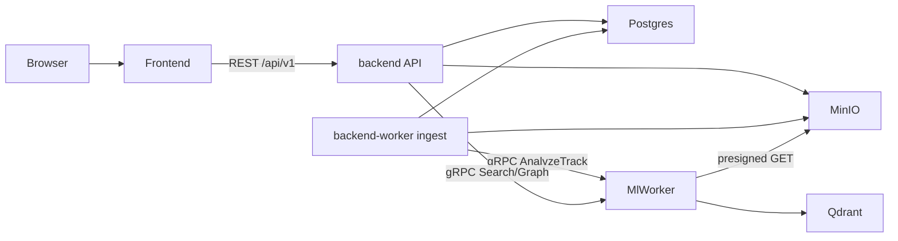

# Tunelink SPEC

Single-user music catalog app: import songs, index them with ML into a vector graph, and search by natural language, audio similarity, and neighborhood exploration.

This document is the source of truth for architecture and product boundaries. Implementation lives under `apps/`; infra under root `docker-compose.yml`.

## Goals

- Index a personal music library with ML so search is better than filename/tag matching alone.
- Keep the control plane (catalog, jobs, auth, OpenAPI) separate from the ML compute plane.
- Ship a simple React UI (shadcn + reagraph) against a typed OpenAPI client.
- Run everything locally with Docker Compose (Postgres, Qdrant, MinIO).

## Non-goals (v1)

- Multi-tenant orgs, WorkOS, or public SaaS auth.
- Cloud Terraform / AWS production deploy (documented as future only).
- Browser→MinIO CORS / public MinIO for uploads (API proxies file uploads instead).
- Hand-rolled SVG force graphs.
- Downloading / ripping full tracks from Spotify, YouTube, or other streaming services for indexing (ToS + copyright). Import is **user-supplied audio only**.
- Putting ZIP unpack or bulk fan-out inside the ML worker or the HTTP request path.

## Stack

| Layer | Choice |
|-------|--------|
| Frontend | React + React Router (static SPA, `ssr: false`), Vite, shadcn, reagraph; **pnpm** |
| API client | `@hey-api/openapi-ts` generated from FastAPI OpenAPI |
| Backend | FastAPI (OpenAPI-compliant), Pydantic; **uv** + **uvicorn** |
| ML worker | Python gRPC service (protobuf); **uv** (gRPC server; uvicorn only if an HTTP health/dev shim is added) |
| Relational DB | **PostgreSQL** |
| Vector DB | Qdrant (dual collections: sonic/audio + language profile) |
| Object storage | MinIO (S3-compatible) |
| Infra | Docker Compose at repo root |

## Repository layout

```text
tunelink/
  apps/
    backend/      # API (uvicorn) + ingest worker (same package, second process)
    frontend/     # React Router static app
    ml-worker/    # gRPC ML compute plane only
  proto/          # shared protobuf (backend ↔ ml-worker)
  docs/
    SPEC.md
    ML.md
    INGEST.md
  compose.yaml
  compose.dev.yaml
  compose.prod.yaml
```

## Architecture



### Ownership (hard boundaries)

| Plane | Process | Responsible for | Not responsible for |
|-------|---------|-----------------|---------------------|
| **API** | `apps/backend` + uvicorn | Auth, OpenAPI, upload proxy to MinIO, catalog/search HTTP, job status | ZIP unpack, long batch loops, embeddings, Qdrant |
| **Ingest** | `apps/backend` + `worker` entrypoint | `import_job`, safe ZIP extract, creating tracks/`ml_job`, enqueue analyze | Auth UI/API policy, model weights, search ranking |
| **ML** | `apps/ml-worker` | Analyze / search / graph, Qdrant writes | Auth, Postgres catalog, ZIP, permanent storage creds |
| **Frontend** | `apps/frontend` | Upload UX, catalog/search/graph UI | Business rules, secrets |

Detail for ingest: [INGEST.md](INGEST.md). Detail for ML: [ML.md](ML.md).

**Code rule:** keep packages/modules named by plane (`auth/`, `api/`, `ingest/`, `ml_client/`). Ingest must not live inside FastAPI route handlers; ML must not import backend auth/models.

# Auth (v1)

Email + password against Postgres. Session is an HttpOnly cookie carrying a JWT signed with Authlib’s JOSE stack ([joserfc](https://docs.authlib.org/en/v1.0.0/jose/jwt.html)).

**Bootstrap:** `POST /api/v1/auth/register` works only while there are zero users; that first account becomes `master` and public registration closes. Afterward everyone uses `POST /api/v1/auth/login`. The master creates more accounts with `POST /api/v1/auth/users`. Public `GET /api/v1/auth/status` exposes `{ registration_open }`. Frontend calls go through `api.v1.*` (`~/lib/api`).

## Data model (Postgres)

Conceptual tables (names may be refined in migrations):

### `track`

| Field | Notes |
|-------|-------|
| `id` | UUID |
| `title`, `artist` | Prefer ID3/tags over filename heuristics |
| `original_filename`, `object_key`, `content_type`, `size_bytes` | Object storage pointer |
| `cover_object_key`, `cover_color` | Optional artwork |
| `status` | `uploading` → `queued` → `indexing` → `ready` \| `failed` |
| `model_provider`, `model_version` | Embedding recipe identity |
| `analysis` | JSONB — tags, mood, segments, waveform, scores |
| `imported_at`, `indexed_at`, timestamps | |

### `import_job`

Batch import progress: `queued` \| `running` \| `complete` \| `failed`, counts, error summary.

### `ml_job`

Per-track analysis job: links `track_id`, provider job/rpc id, status, error, timestamps. Used so the UI can poll progress while the worker runs.

**No** `organization_id` column — single catalog for the one user.

## Object storage (MinIO)

- Bucket for catalog audio (and optional covers).
- Browser uploads go through the **API** (`multipart/form-data`); the API writes objects to MinIO on the Docker network (no browser CORS to MinIO).
- ML worker will fetch audio with a short-TTL **presigned GET** (or internal GET) when wired.

Object key pattern (example): `tracks/{track_id}/{filename}`.

## Vector index (Qdrant)

See [docs/ML.md](ML.md) for the full algorithm. Summary:

1. **Audio** — MuQ-MuLan clip → segment → track vectors (512-d).
2. **Language profile** — Essentia-derived prose/tags → MiniLM (384-d).
3. **Ranking** — z-score calibrate each space vs catalog baseline, blend, optional soft tag boost (no hard lexical veto).
4. Collection names include **model version**; recipe changes require reindex + golden-query evals.

## Ingest pipeline

See [INGEST.md](INGEST.md). Summary:

- **Single file:** API multipart upload → MinIO → `track` + `ml_job` → ML `AnalyzeTrack`.
- **ZIP batch:** API multipart ZIP upload → **ingest worker** safe-extracts → N tracks/`ml_job` → ML analyze.
- API returns after the object is stored; ingest worker owns ML orchestration; ML worker owns indexing math only.

## Search & graph

Backend exposes REST endpoints that call the worker over gRPC, then hydrate track metadata from Postgres:

| Capability | Worker RPC | Notes |
|------------|------------|-------|
| Text search | `SearchText` | Optional negative query; tracks or segments mode |
| Audio search | `SearchAudio` | Temporary reference audio URL |
| Similar tracks | `SimilarTracks` | Neighbors of an indexed track |
| Graph | `Graph` | One similarity neighborhood view driven by blended `weight` (audio/profile components stored but not separate UI modes). See [ML.md](ML.md#graph). |

Frontend graph UI uses **reagraph**, not a custom SVG force simulator.

## gRPC surface (`proto/`)

Service sketch (names finalized in `.proto` files):

```text
service MlWorker {
  rpc AnalyzeTrack (AnalyzeTrackRequest) returns (AnalyzeTrackResponse);
  rpc SearchText (SearchTextRequest) returns (SearchResponse);
  rpc SearchAudio (SearchAudioRequest) returns (SearchResponse);
  rpc SimilarTracks (SimilarTracksRequest) returns (SearchResponse);
  rpc Graph (GraphRequest) returns (GraphResponse);
}
```

Request/response shapes should mirror the validated contracts from the goodtaste MVP (minus `organization_id`):

- Analyze: `job_id`, `track_id`, `audio_url`, `filename` → duration, bpm, genre/mood/tags/scores, segments, waveform, model identity.
- Search: `query` / `audio_url` / `track_id`, `top_k`, mode → ranked `track_id` + scores + reasons.
- Graph: optional `focus_track_id`, `limit` → `node_ids` + links (`weight`, `audio_weight`, `profile_weight`, reasons).

Protobuf lives in `proto/`; backend and ml-worker generate stubs from the same definitions.

## Frontend ↔ backend typing

1. FastAPI emits OpenAPI from route/Pydantic models.
2. Frontend runs `@hey-api/openapi-ts` against that schema.
3. UI only talks to generated clients — no hand-written DTO drift.

## Local infra

`compose.yaml` runs **Postgres, Qdrant, and MinIO**. App overlays add API, **backend-worker (ingest)**, frontend, and later ml-worker. Ingest is a second process of the backend package, not a third Python app and not part of ml-worker.

## Future (not v1)

- OpenTelemetry traces across API → worker → Qdrant.
- Grafana / CloudWatch dashboards.
- Real S3 + managed Postgres for remote deploy.
- Stronger auth if the app leaves single-user localhost.

---

## External reference: goodtaste `__OLD__`

The vibe-coded MVP lives outside this repo at:

`~/Documents/GitHub/goodtaste/__OLD__/`

Do **not** copy or symlink it into Tunelink. Cite and learn from these paths:

| Topic | Path |
|-------|------|
| Worker overview & scoring docs | `goodtaste/__OLD__/apps/ml-pipeline/README.md` |
| Operation contracts | `.../apps/ml-pipeline/app/runpod_worker/contracts.py` |
| Analyze / search / graph ops | `.../apps/ml-pipeline/app/runpod_worker/operations.py` |
| Qdrant dual-index + blending | `.../apps/ml-pipeline/app/runpod_worker/vector_store.py` |
| Catalog + job schema ideas | `.../packages/db/src/schema.ts` (catalog/jobs only; ignore auth/org leftovers) |
| Import / job / callback flow | `.../packages/api/src/http/ml/ml-catalog.service.ts` |
| Compose deps pattern | `.../docker-compose.yml` |

### Reuse (ideas, not code dumps)

- Control plane vs compute plane split; worker has no permanent storage creds.
- Dual embeddings (MuQ sonic + MiniLM profile) with calibrated blend.
- Durable import + ml job status machine.
- Presigned, short-lived audio access for the worker.
- Reindex + golden-query eval discipline when changing the embedding recipe.

### Avoid copying

- NestJS / Nestia / MariaDB / WorkOS / multi-tenant org filters.
- Multipart uploads through the API node.
- Filename-only title/artist heuristics as the long-term metadata source.
- Lexical “scroll the whole catalog” gates that do not scale.
- Custom ~1.6k-line SVG graph explorer — use reagraph.
- Shipping graph “relation modes” that are not backed by distinct retrieval.
- HTTP/RunPod emulator as the long-term API↔worker transport — Tunelink uses **gRPC + protobuf**.
